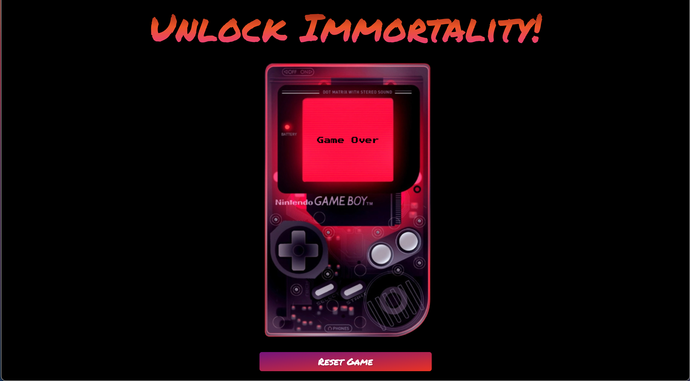

# Konami Code Project

This project is a fun implementation of the legendary Konami Code, made famous through its use in a number of games from Konami.

## Overview

The Konami Code was a cheat code that appeared in a number of games from Konami. One such game was Contra, an early NES game that popularized the code. Originally, Contra would start you with 3 lives per game, but if you entered the Konami Code after the start screen, you'd get a whopping 30 lives! The Konami Code goes as follows: Up, Up, Down, Down, Left, Right, Left, Right, B, A, Enter ( ↑ ↑ ↓ ↓ ← → ← → B A Enter ).

Enter the Konami Code, and something interesting will happen...

## Technologies Used

This project was built using HTML, CSS, JavaScript, and jQuery. These technologies were combined to create an interactive and engaging web experience.

## How to Use

1. Clone or download the repository.
2. Open the `index.html` file in your web browser.
3. Use your keyboard to input the Konami Code.
4. See what happens when the code is entered correctly!

## Screenshots

## Live Demo

A live demo of this project is available here [Konami Code](https://konami-code-project.vercel.app/).

This project was built as an homage to the Konami Code, the influence of which in the gaming culture cannot be overstated
